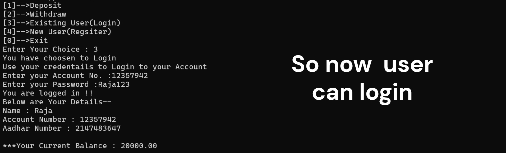

# 🚀 Bank Management System
_A short project to demonstrate the File handling and logic buidling in C lang._


---

## 📌 Table of Contents
- [🚀 Bank Management System](#-bank-management-system)
  - [📌 Table of Contents](#-table-of-contents)
  - [📖 About](#-about)
  - [✨ Features](#-features)
  - [🎯 Demo](#-demo)
  - [⚙️ Installation](#️-installation)
  - [📌 Usage](#-usage)
  - [🖼 Screenshots](#-screenshots)
  - [🤝 Contributing](#-contributing)
  - [📜 License](#-license)
  - [📬 Contact](#-contact)


## 📖 About
Bank Management System is a CLI (Comand Line Interface) tool that domonstrates the C lang possibilities 
of handling files and logic buiding with help of simple short project that can help understanding 
basic c concepts.

It is a system that features --

[1]-Application for Account Opening 

[2]-A Manager panel to approve or deny application regarding account opening or closing

[3]-Can store accounts information in file that is , it has persistent data storage even after closing the application

[4]-Deposit to one's account without authentication

[5]-Withdraw only after successfull authentication

[6]-Menu to update details of Account 

[7]-Application for Account Closing 

✨It can keep record of basic information of some accounting like problems like --

[1]-Can be used in some game data (for storing user details and its points)

[2]-For keeping record of deposit or withdraw 


## ✨ Features
- Account Opening
- Account Closing
- Deposit to account
- Withdraw from account
- Manager Panel 
- Review application by Manager
- Updaing Account Details


## 🎯 Demo
- [YouTube Demo](https://youtu.be/weAhWpbSz4E)
- [Linkediin Post](https://www.linkedin.com/posts/rajajainds_demo-for-bank-management-system-project-in-activity-7361593996848021506-EItg?utm_source=share&utm_medium=member_desktop&rcm=ACoAAEP0p4YBoiu-yAaQoH2mCAGz_xZmfPrO8fU)


## ⚙️ Installation
```bash
# 1. Clone the repository
git clone //github repository

# 2. Navigate into the project folder
cd BankManagementSystem

# 3. Compile all files using below command 
gcc main.c Utilities.c Manager.c Menu.c Register.c Login.c Deposit.c Withdraw.c -o BankSystem

```

## 📌 Usage
1.Run the executable after compiling all files (see above in installation)

2.Create a account

3.Needs to be verified by the manager 

4.After account approval it can be logged in 

5.After login details can be updated ,withdraw and deposit and also account can be applied for deletion 

6.withdraw needs authentication

7.deposit can be done by anyone (without authentication for account)

8.Manager needs to approve for account closing

## 🖼 Screenshots
[Account_Registration]


[Manager_Login_and_Review]


[Account_Login]



## 🤝 Contributing

Contributions are welcome!

Follow these steps to contribute:

1.Fork this repository

2.Create a new branch (git checkout -b feature-branch)

3.Commit your changes (git commit -m 'Add new feature')

4.Push to the branch (git push origin feature-branch)

5.Open a Pull Request


## 📜 License

This project is licensed under the MIT License - see the LICENSE file for details.


## 📬 Contact

Raja Jain – rajajainds@gmail.com

GitHub: @rajajainds

LinkedIn: www.linkedin.com/in/rajajainds
